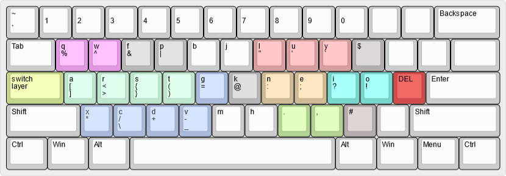

# programak
alternative comfort-focused keyboard layout for programmers

# why colors?

symbol keys are grouped by colors. similar (grouped) symbols are using same color.
use this picture to learn the layout.

# how to use

In order to type symbols, press "switch layer" key once and then key with symbol. after typing symbol once, layout will switch back to letters layer.
Delete keys with your right pinky.

# design decisions

### letter layout

- colemak dh mod

    Colemak is very comfortable to type. I use DH mod but it can be changed to vanilla colemak
    
### symbol switching

- switch layer with pinky finger

    There is usually caps lock next to left pinky finger but it is not often used. It is a waste because this key is very accessible. Since programmers use a lot of symbols, I put "switch to symbols" key instead of caps lock.
    
    
- switch layer without holding shift

    Typing symbols often include holding shift and then pressing key with symbol. Pressing once is more comfortable than holding the key.
    
- layout switch back to alphabet after you type symbol

    When programming, symbols are often typed between words (variables, functions etc). So going back to letters after typing symbol is more comfortable.
   
### delete key (backspace)

- backspace with pinky finger

    Backspace key is usually very far away and we waste time to search it on keyboard. To make deleting more comfortable the key is moved closer to home row
  
### parenthesis

- parentheses symbols on home row

    when programming we use a lot of parentheses (writing functions) so they should be in most comfortable place (home row)  
    
- closing parentheses on the same key -> {}

    It is easier to remember if opening and closing parentheses are on the same key.
    
- parentheses opening is prioritized

    When programming we often open the parenthesis and IDE automatically closes it. So closing parentheses are less important.

### symbol positions 
 
- swapped comma with dot

    When programming we use dot more often than comma. The positions are the same as colemak (easier to remember), just swapped.
    
- calculation symbols next to each other

    When symbol keys are next to each other, the layout is easier to remember.
    
    
- /\ on the same key

    Those keys are similar so it is easier to remember
    
- \- and _ on the same key

    Those keys are similar so it is easier to remember
    
- & and | grouped

    Those keys often represent AND and OR so are related. Put then next to each other to make them easier to remember.
    
- % and ^ grouped, on the left top

    Those keys are used in calculations so are on the left where other calculation symbols are nearby -> */+-

# todo
- easier cut, copy, paste
- arrows more accessible

# history

v1 - 2019

v2 - 2020: moved backspace, moved switch layer button, changed symbols layout a bit
